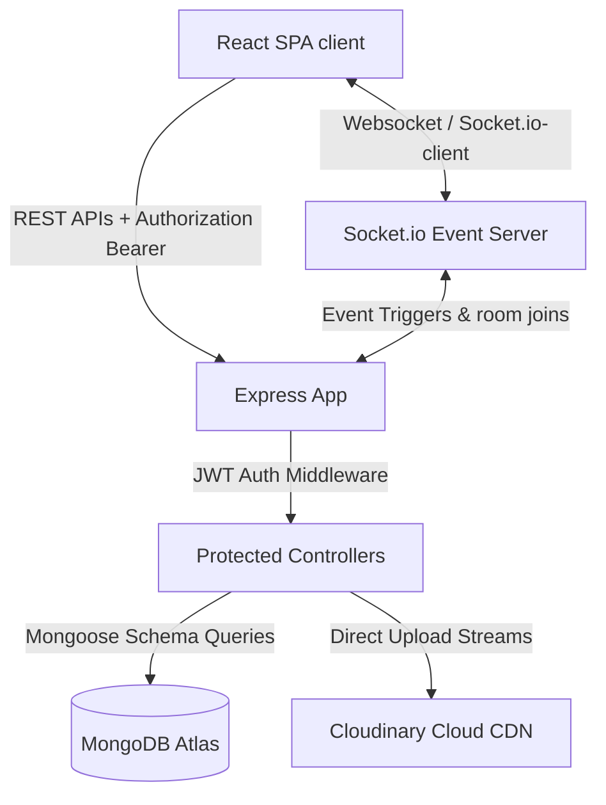

# 💬 MOJI - Modern Real-Time Chat Web Application

[](https://react.dev/)
[](https://www.typescriptlang.org/)
[](https://nodejs.org/)
[](https://www.mongodb.com/)
[](https://socket.io/)
[](https://tailwindcss.com/)
[](https://opensource.org/licenses/ISC)

Moji is a professional-grade, high-performance, real-time chat application featuring a sleek user interface, direct and group messaging, friend request mechanics, rich media sharing, message threading (replies), and emoji reactions.

---

## 🔍 Project Overview

### What is Moji?
Moji is a full-stack, single-page communication platform built using **React 19**, **TypeScript**, and **Express.js**, backboned by a **MongoDB** database and utilizing **Socket.io** for bi-directional, real-time data flows.

### What Problems Does It Solve?
Most chat apps suffer from high latency, redundant network requests (e.g., polling for updates), and security exposures like XSS token theft. Moji solves this by:
*   **Zero-Latency Interactions:** Offloading new messages, typing cues, seen statuses, and reactions directly to WebSocket channels.
*   **Security-First Session Handling:** Storing short-lived JWTs in memory, using `httpOnly` refresh tokens in cookies, and utilizing TTL database collections to prevent persistent tracking vulnerabilities.
*   **Optimal Database Reads:** Denormalizing active chat cards (`lastMessage` object) to completely bypass performance-heavy MongoDB aggregation queries on user chat feeds.

### Why Built It?
Moji was developed to showcase an enterprise-ready architecture. It demonstrates:
1.  Scalable real-time event synchronization.
2.  Strict security controls (CORS, secure cookie sessions, request body validator schemas).
3.  Optimized DB indexing and canonical data structures.
4.  Modern visual excellence using Tailwind CSS v4, custom glassmorphism overlays, and micro-animations.

---

## 🎨 Demo & Screenshots

| Authentication Page | Real-Time Chat Workspace |
| :---: | :---: |
|  |  |

> 🌐 **Live Demo:** [Deploy Link (Vercel + Render)](https://moji-chat-3v4w.onrender.com/)

---

## ✨ Core Features

*   **⚡ Real-Time Connection Engine:** Dynamic user presence status indicator ("Online" / "Offline"), real-time text delivery, message indicators, and instant synchronization across multiple logged-in devices.
*   **🛡️ Multi-Tiered Authentication:**
    *   Short-lived JWT Access Tokens (30 min) stored in client memory.
    *   Secure, `httpOnly`, `sameSite: "none"` Refresh Tokens (14 days) stored in cookies to defend against XSS/CSRF attacks.
    *   Session tracking database model featuring Mongoose TTL indices (`expireAfterSeconds: 0`) for automated cleanup.
*   **👥 Friendship System:** Friend requests dispatch system (sent vs. received lists) with a lexicographically sorted canonical indexing layout (`userA < userB` validation) preventing duplicated friendship schemas.
*   **💬 Versatile Chats:** Support for **Direct Chats (1-to-1)** and **Group Chats** with custom avatars, dynamic members search, and group creation triggers.
*   **💭 Interactive Rich Messages:**
    *   **Image Attachments:** Fast Cloudinary processing using buffered memory streams (completely bypassing local disk overhead).
    *   **Reply & Quotes:** Threading engine linking messages (`replyTo` relationships).
    *   **Reactions:** Inline emoji reactions (`emoji-mart` popovers) synchronized in real-time with automatic count aggregates.
*   **📱 Dynamic UI Design System:** Premium pastel purple theme with glassmorphism layout controls, responsive split-view sidebar, automated scroll-loading history (cursor-based pagination), dynamic badge counts, and native togglable Dark Mode.

---

## 🛠️ Tech Stack & Tools

### Frontend
*   **Core:** React 19, TypeScript, Vite (build engine)
*   **State Management:** Zustand (with storage persistence middleware)
*   **Routing:** React Router v7
*   **UI Components:** Radix UI primitives, Lucide React (Icons), Emoji Mart
*   **Styling:** Tailwind CSS v4 (with custom `@theme` utilities, CSS variables, and keyframe animations)
*   **Forms & Validation:** React Hook Form + Zod schemas
*   **HTTP Client:** Axios (configured with intercepts for token refresh)

### Backend
*   **Core:** Node.js, Express.js (ES Module standard)
*   **Realtime:** Socket.io (WebSocket protocol engine)
*   **Database:** MongoDB via Mongoose ODM
*   **Authentication:** JSON Web Tokens (jsonwebtoken) & bcrypt hashing
*   **File Handling:** Multer (Memory Storage) & Cloudinary SDK
*   **Documentation:** Swagger UI (swagger-ui-express)

---

## 📐 Architecture & System Design

Moji adopts a decoupled, event-driven architecture structured around clear separation of concerns:



### Key Architectural Decisions:
1.  **Cursor-Based Pagination:** Instead of offset-based pagination (`skip().limit()`), which slows down as message datasets grow, Moji uses **createdAt cursor queries** (`createdAt: { $lt: cursor }`), ensuring constant-time ($O(1)$) database queries for chat histories.
2.  **State-Syncing Engine:** Zustand acts as a single source of truth on the client. Socket listeners directly manipulate the local stores (`addMessage`, `updateMessageReaction`, etc.) to trigger fast reactive UI updates without manual polling.
3.  **Canonical Pairing:** Friendships are saved by sorting participants lexicographically (`userA` < `userB`). This database constraint keeps index sizes small and guarantees queries check only a single pairing instance.
4.  **Denormalization for Speed:** Conversations store a small `lastMessage` sub-document. When a message is sent, the parent conversation is updated simultaneously. Reading the inbox feed requires zero joins or lookups.

---

## 📂 Project Structure

```
moji/
├── backend/
│   ├── src/
│   │   ├── controller/          # Request handlers (Auth, Conversation, Friends, Message, User)
│   │   ├── libs/                # MongoDB database connection wrapper
│   │   ├── middlewares/         # JWT Auth, Friendship checkers, Multer uploads, Socket Auth
│   │   ├── models/              # Mongoose Data Models (User, Message, Conversation, Friend, Session)
│   │   ├── routes/              # Express API Route controllers mapping
│   │   ├── socket/              # Socket.io connection orchestration & event listeners
│   │   ├── utils/               # Broadcast and state helpers (messageHelper)
│   │   ├── server.js            # Express server initial configuration & startup
│   │   └── swagger.json         # Swagger API Open Specs details
│   ├── .env                     # Local environment settings
│   └── package.json             # Backend scripts and Node modules manifest
└── frontend/
    ├── src/
    │   ├── components/          # Reusable component views (Modals, Chat layout, UI atoms)
    │   ├── hooks/               # Custom lifecycle helper hooks
    │   ├── lib/                 # Tailwind Merge & Date formatting helpers
    │   ├── pages/               # Routing target containers (Chat, Signin, Signup, Home)
    │   ├── services/            # Axios API endpoint calls wrapper services
    │   ├── stores/              # Zustand hooks (Auth, Chat, Friend, Socket, Theme)
    │   ├── types/               # Type Definitions mapping files
    │   ├── App.tsx              # Application shell & routing engine
    │   ├── index.css            # Base stylesheet containing pastel variables & layout styling
    │   └── main.tsx             # DOM initialization script
    ├── tailwind.config.ts       # Tailwind configurations overrides
    ├── tsconfig.json            # Strict TypeScript rules settings
    └── package.json             # Frontend dependency packages registry
```

---

## 🚦 Getting Started

### Prerequisites
*   Node.js (v18 or higher)
*   npm or yarn
*   MongoDB Instance (Local or MongoDB Atlas)
*   Cloudinary Account (Free tier)

### 1. Clone the Repository
```bash
git clone https://github.com/duykhanh-tran/TD-chat.git
cd TD-chat
```

### 2. Configure Environment Variables
Create a `.env` file in the **backend** directory:
```env
PORT=5001
MONGODB_CONNECTIONSTRING=mongodb+srv://<username>:<password>@cluster.mongodb.net/moji-db
CLIENT_URL=http://localhost:5173
ACCESS_TOKEN_SECRET=your_jwt_access_secret_key_here

CLOUDINARY_CLOUD_NAME=your_cloudinary_cloud_name
API_KEY=your_cloudinary_api_key
API_SECRET=your_cloudinary_api_secret
```

Create a `.env.development` file in the **frontend** directory:
```env
VITE_API_URL=http://localhost:5001/api
VITE_SOCKET_URL=http://localhost:5001/
```

### 3. Run Locally

#### Start Backend:
```bash
cd backend
npm install
npm run dev
```
*Backend server runs on [http://localhost:5001](http://localhost:5001)*  
*API documentation is available at [http://localhost:5001/api-docs](http://localhost:5001/api-docs)*

#### Start Frontend:
```bash
cd ../frontend
npm install
npm run dev
```
*Frontend hot-reloading server runs on [http://localhost:5173](http://localhost:5173)*

---

## 📝 API Reference

All requests must include the header `Authorization: Bearer <your_access_token>` except for public endpoints.

### Authentication
*   `POST /api/auth/signup` - Register a new user profile.
*   `POST /api/auth/signin` - Authenticate user, return JWT `accessToken` in body and HTTP-only `refreshToken` cookie.
*   `POST /api/auth/signout` - Revoke session, delete refreshToken from database, clear cookie.
*   `POST /api/auth/refresh` - Request a new `accessToken` using the cookie-supplied refresh token.

### User Directory
*   `GET /api/users/me` - Retrieve authenticated user profile information.
*   `GET /api/users/search?username=name` - Search for a user.
*   `POST /api/users/uploadAvatar` - Upload a profile image (multipart/form-data).

### Friend Requests & Friendships
*   `GET /api/friends/` - Fetch all accepted friends.
*   `GET /api/friends/requests` - Fetch all incoming and outgoing requests.
*   `POST /api/friends/requests` - Send a friend request (requires `to` userId).
*   `POST /api/friends/requests/:requestId/accept` - Accept a pending request.
*   `POST /api/friends/requests/:requestId/decline` - Decline a pending request.

### Conversations & Messaging
*   `GET /api/conversations/` - Fetch user conversation lists.
*   `POST /api/conversations/` - Initiate a conversation (direct or group).
*   `GET /api/conversations/:conversationId/messages` - Fetch messages (supports cursor pagination `?cursor=ISOString&limit=50`).
*   `PATCH /api/conversations/:conversationId/seen` - Mark all incoming messages in conversation as read.
*   `DELETE /api/conversations/:conversationId` - Hide the conversation (soft-delete for current user).
*   `POST /api/messages/direct` - Send a message to a direct chat.
*   `POST /api/messages/group` - Send a message to a group chat.
*   `POST /api/messages/:messageId/react` - Toggle an emoji reaction on a message.

---

## 🗺️ Product Roadmap

- [ ] **📞 Peer-to-Peer Calling:** Introduce voice and video calling using WebRTC.
- [ ] **🔍 Chat Search:** Implement fuzzy indexing on Mongoose messages for global history searches.
- [ ] **📂 File Sharing System:** Support sending PDFs, ZIP archives, and voice note recordings.
- [ ] **🔔 Push Notifications:** Hook up Firebase Cloud Messaging (FCM) or Web Push API for background notifications.
- [ ] **🔒 End-to-End Encryption (E2EE):** Integrate the Signal Protocol for private direct messaging.

---

## 👤 Author & Contact

*   **Author:** Duy Khanh Tran
*   **GitHub:** [@duykhanh-tran](https://github.com/duykhanh-tran)
*   **LinkedIn:** [Your LinkedIn Profile](https://linkedin.com/in/your-profile)
*   **Email:** [your-email@example.com](mailto:your-email@example.com)

---
*Developed with 💜 by Duy Khanh Tran.*
